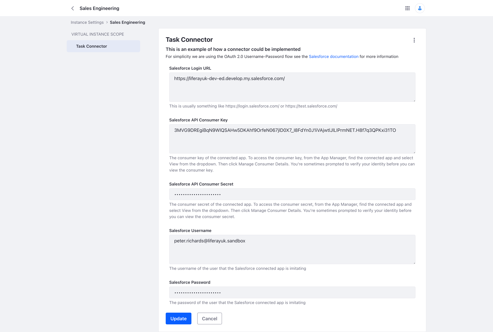

# Salesforce Task Connector
An example of how a custom Salesforce connector could be implemented in Liferay.

**Note:** _This example uses an OSGi approach which is not compatible with the [Liferay Experience Cloud (SaaS)](https://www.liferay.com/products/liferay-cloud-capabilities)._

## Talend

The official [Liferay Connector to Salesforce](https://learn.liferay.com/w/commerce/add-ons-and-connectors/salesforce/liferay-connector-to-salesforce#deploying-the-connector-to-liferay-dxp) uses a Talend job to import data from Salesforce into Liferay DXP.

Talend provides a visual way of mapping the data integration and Liferay's [Job Scheduler](https://learn.liferay.com/w/dxp/building-applications/core-frameworks/job-scheduler-framework/using-job-scheduler) allows these jobs to be scheduled without any downtime.

This approach can often remove the need to create more tightly coupled integrations using custom OSGi modules.

### Enable Logging

The base package for these modules is com.liferay.sales.engineering and this can be used when configuring loggers, if required.

In Liferay a new logger can be created through the Server Administration option in the Control Panel. Look
on [Learn Liferay](https://learn.liferay.com/dxp/latest/en/system-administration/using-the-server-administration-panel/configuring-logging.html#configuring-logging)
for more information on how to configure the logger.

### Liferay Version Dependency

These extensions have been tested with 7.4 U71.

## Liferay Object Definition

[Task Object definition](/modules/task-connector-service/Object-Task.json)

## Configuration

### Salesforce Authentication

### Job Scheduler

[Configuration Properties](/modules/task-connector-dispatch-executor/job-scheduler.properties)